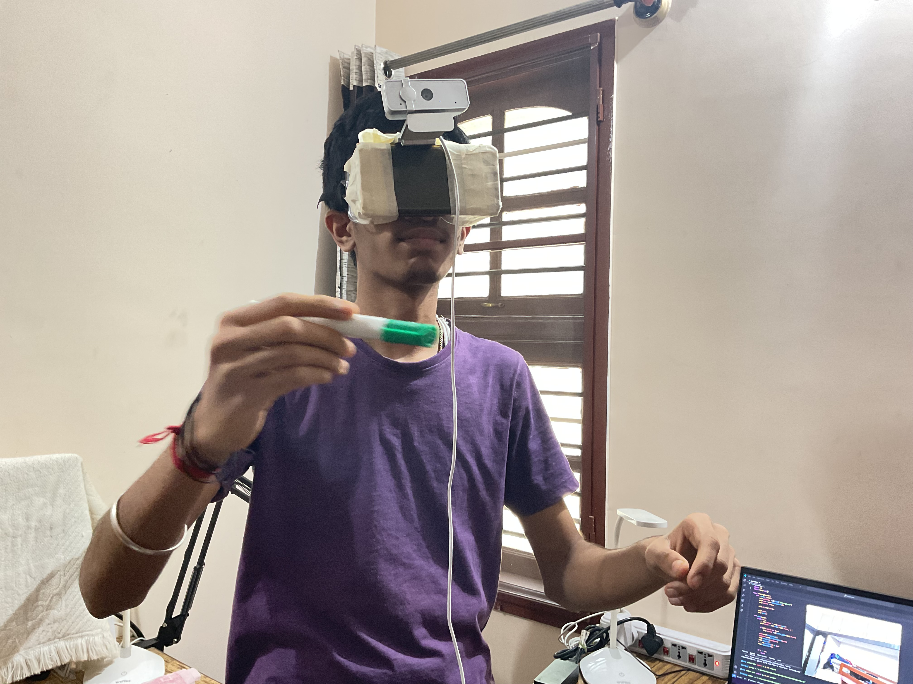

### My Apple Vision Pro

I wanted to make my own Apple Vision Pro after seeing the original Apple Vision Pro. So, I created a special vision OS that runs the AirSketch program.

You can see how AirSketch works in action by clicking <a href="https://x.com/suhasasumukh/status/1753769807659536404?s=20">here</a>. Inside this repository, you'll find all the program files you need to run AirSketch. As for the hardware, you can build it according to your preferences or you can use this AirSketch program files to run it as a standalone program.

Take a look at the hardware side of my Apple Vision Pro in the image below:



#### My side of hardware includes:
- Snorkelling googles
- External FHD Webcam
- Mobile
- Laptop/PC for running the Vision OS AirSketch Program

#### Tech Stack:
- OpenCV [for vision]
- Numpy [for array manipulations]

#### Prerequisites:
- Python 3.10.1
- Install the required dependencies using the following command:

```bash
pip install -r requirements.txt
```

#### Clone the repository:
Follow these steps:

```bash
git clone https://github.com/suhasasumukh/AppleVisionPro
```

```bash
cd AppleVisionPro
```

```bash
code .
```

The `code .` command will open the  open the current directory in VS Code. Once VS Code is loaded follow these steps:

1) Go to the Extensions view using the icon with four squares on the sidebar.
2) Search for "Code Runner."
3) Click the install button.

This will install the "Code Runner" extension. After installation, reload VS Code. Open `process.py` and run the program by clicking on the Code Runner play button in the top-right corner.


